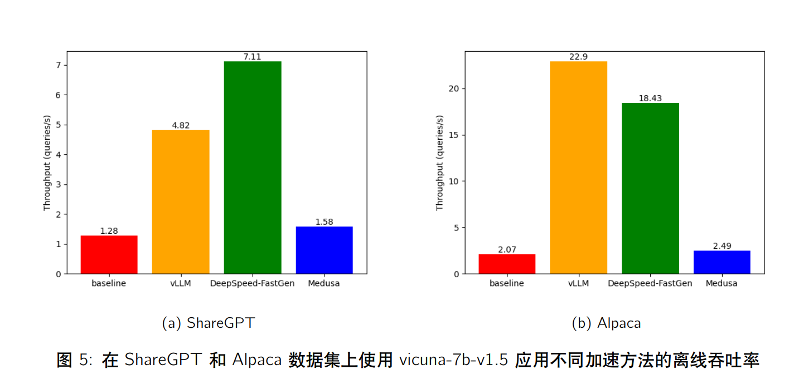
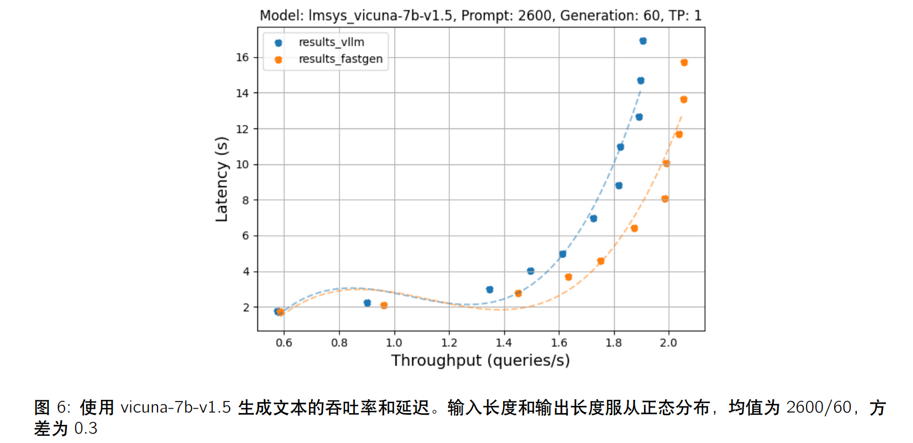

# LLM Efficiency





本仓库提供了 2024-Spring 学期，数值分析课程 LLM Efficiency project 的实验代码

## Flash Attention 

将 Long Range Arena 数据集下载至 `flashattention/data` 目录下。运行方式为：

```shell
cd flashattention
python main.py --attn <attention-name> --task <task-name>
```

`<attention-name>`:

- `softmax`: baseline
- `skyformer`
- `cosformer`
- `flashattention`

`<task-name>`:

- `lra-listops`
- `lra-pathfinder`
- `lra-retrieval`
- `lra-text`
- `lra-image`

## Throughput 测试

将 ShareGPT 或 Alpaca 数据集下载至 `throughput/data` 目录下。运行方式为：

```shell
cd throughput
python benchmark_throughput.py --backend <backend-type>
```

`<backend-type>`:

- `hf`: baseline

- `vllm`: PagedAttention
- `mii`: DeepSpeed-FastGen
- `medusa`: Medusa

## Throughput-Latency 测试

修改 `run.sh` 脚本中的参数，运行方式为：

```shell
cd throughput-latency
bash run.sh
```

