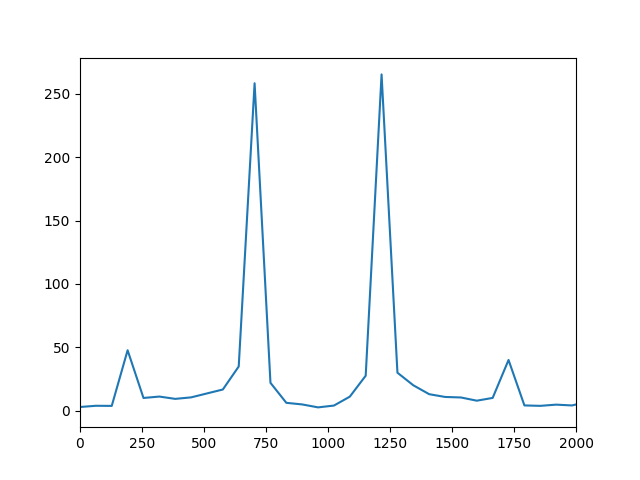

# Lab2 实验报告

## 实验思路

输入为$10$秒的音频，采样频率为$48000Hz$，故输入为$480000$个采样点，每$\frac{48000}{64}=750$个采样点为一帧，共$640$帧。

我们将输入按以上的方式分为$640$帧，每一帧做 `rfft`，得到长度为$376$的频谱。并且，频谱中两个相邻点的实际频率差为$\frac{f_s}{N}=640$。以第一帧为例，画出 `rfft`的结果（x轴为实际频率）：

可以看到，频谱有两个尖峰，大致在$697Hz$和$1209Hz$附近。于是我们以如下的思路判断每一帧对应的是什么按键：

- 首先判断该帧的能量是否小于某阈值（一般来说，非静默帧的rfft的平方和为150000左右，而静默帧的rfft的平方和为700左右，这里threshold设为20000），如是，则判定为-1
- 计算出该帧 `rfft`频谱结果中频谱（绝对值）最大的两个点，并计算他们与哪个按键的频率最接近：
  - 例如某一帧的最高峰的两个点对应了$700Hz$和$1200Hz$，那么在12个按键中，因为$|700-697|+|1200-1209|$最小，所以将其判断为按键1。
